# Devsu — DevOps Technical Test

**Author:** Jorge Alexander Caballero Ortiz · `jcaballeroo96@gmail.com`
**Stack target:** Node.js (Express + Sequelize + SQLite) → Docker → Kubernetes → Terraform on AWS Free Tier
**CI/CD:** GitHub Actions · Registry: **Amazon ECR (via OIDC, no static keys)** · IaC: Terraform 1.10+

---

## 1. What this repo delivers

| Requirement (test brief) | Where it lives |
|---|---|
| Dockerize the app (env vars, run user, port, healthcheck) | `app/Dockerfile`, `app/.dockerignore` |
| Pipeline as code (build, unit tests, static analysis, coverage, build & push) | `.github/workflows/ci-cd.yml` |
| Vulnerability scan (optional) | Trivy job in the same workflow |
| Deploy on Kubernetes (≥ 2 replicas, horizontal scaling, ConfigMap, Secret, Ingress) | `k8s/base/` + overlays |
| K8s deploy added to the pipeline | `deploy` job — runs on a **self-hosted runner colocated on the k3s EC2** |
| README with diagrams | this file + `docs/` |
| **Extra: IaC on a public cloud** | `terraform/` (S3 state + VPC + ECR + GitHub OIDC + EC2/k3s + CloudWatch) |
| **Extra: TLS / DNS / etc. for production** | **implemented** — cert-manager + Let's Encrypt + nip.io on the prod overlay (`k8s/overlays/prod/tls-patch.yaml`, ADR-005 + ADR-008) |

---

## 2. Architecture

### 2.1 Component overview

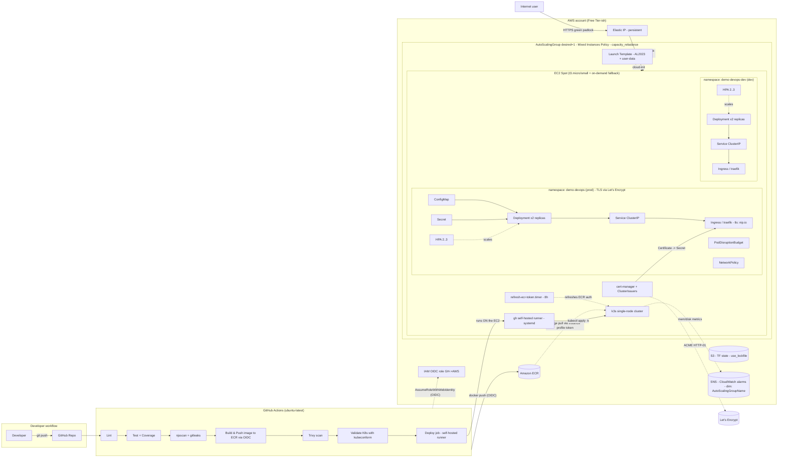

### 2.2 Pipeline

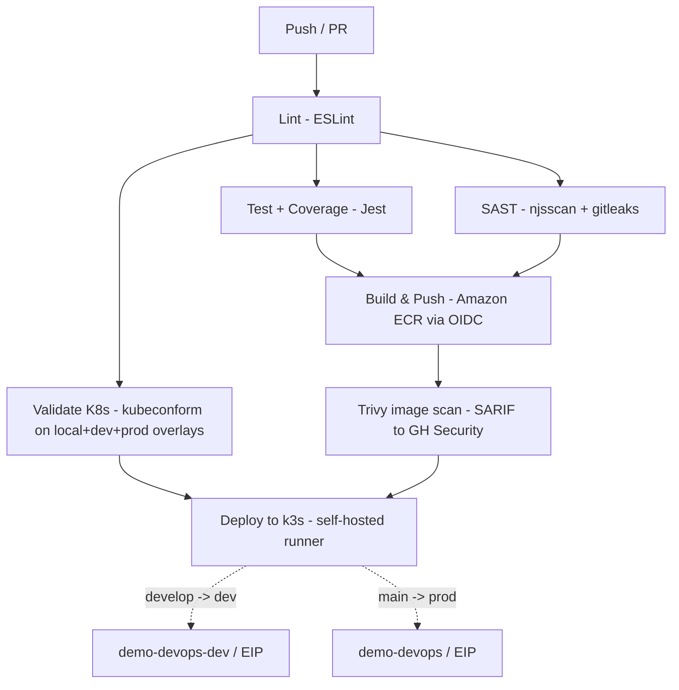

---

## 3. Repository layout

```
.
├── app/                         # Node.js app + Dockerfile
│   ├── Dockerfile               # multi-stage, non-root, HEALTHCHECK, dumb-init
│   ├── .dockerignore
│   ├── .eslintrc.json
│   ├── .env.example
│   ├── index.js                 # + /health endpoint, PORT from env
│   ├── index.test.js            # + health test
│   ├── package.json             # scripts: test:coverage, lint
│   └── ...
├── k8s/                         # Kustomize base + overlays
│   ├── base/                    # Deployment, Service, Ingress, ConfigMap,
│   │                            # Secret, HPA, PDB, NetworkPolicy, Namespace
│   └── overlays/
│       ├── local/               # minikube / docker-desktop, ingress-nginx,
│       │                        # 2 replicas + HPA 2..6 (brief evidence)
│       ├── dev/                 # k3s on EC2, traefik, 2 replicas + HPA 2..3
│       └── prod/                # k3s on EC2, traefik, 2 replicas + HPA 2..3 (ADR-006)
├── terraform/
│   ├── bootstrap/               # S3 state bucket (Terraform 1.10 use_lockfile)
│   ├── modules/
│   │   ├── network/             # VPC + public subnets across two AZs
│   │   ├── ecr/                 # private ECR repo + lifecycle policy
│   │   ├── github-oidc/         # OIDC provider + IAM role for GH Actions
│   │   ├── ec2-k3s/             # EC2 Spot t3.micro + k3s userdata + EIP
│   │   └── monitoring/          # CloudWatch alarms (CPU/mem/disk) + SNS
│   └── environments/dev/        # composition: network+ECR+OIDC+EC2/k3s+monitoring
├── scripts/
│   ├── local-deploy.sh          # build + apply local overlay on minikube
│   ├── k8s-deploy.sh            # manual apply on the k3s host (break-glass)
│   └── port-forward.sh          # expose svc on localhost without ingress
├── .github/workflows/
│   └── ci-cd.yml                # main pipeline (lint, test, SAST, build, scan, deploy)
├── docs/
│   ├── decisions/               # ADRs (architecture decision records)
│   └── screenshots/             # Visual evidence — see §9
├── .gitleaks.toml
├── LICENSE
└── README.md
```

---

## 4. Quick start — local

### 4.1 Run the app

```bash
cd app
cp .env.example .env
npm ci
npm start
# -> Server running on port 8000
curl http://localhost:8000/health
curl http://localhost:8000/api/users
```

### 4.2 Run the tests + coverage

```bash
cd app
npm ci
npm run test:coverage
```

### 4.3 Build the Docker image

```bash
cd app
docker build -t demo-devops-nodejs:dev .
docker run --rm -p 8000:8000 demo-devops-nodejs:dev
curl http://localhost:8000/health
```

### 4.4 Deploy on local Kubernetes (minikube / docker-desktop)

The repo ships `scripts/local-deploy.sh` that does the build + apply +
rollout wait in one go:

```bash
# Optional: minikube with ingress addon
minikube start --addons=ingress

# One-shot deploy (uses minikube's docker daemon if minikube is running)
scripts/local-deploy.sh

# Add hosts entry (Linux/mac):
echo "$(minikube ip) demo-devops.local" | sudo tee -a /etc/hosts

# Hit the app:
curl http://demo-devops.local/health
curl http://demo-devops.local/api/users
```

> On docker-desktop the ingress lives on `127.0.0.1`. Either point your
> hosts file at `127.0.0.1 demo-devops.local`, or use the port-forward
> helper: `scripts/port-forward.sh`.

---

## 5. Quick start — AWS deploy

### 5.1 Prerequisites

- AWS account (ideally with Free Tier still active — see §5.3 about Spot).
- AWS CLI v2 configured (`aws configure`) — needs `iam`, `s3`, `ec2`, `ecr`, `sns` permissions for the bootstrap user.
- Terraform **>= 1.10** (for native S3 state locking).
- A public GitHub repo with this code.
- A GitHub fine-grained PAT with **`Administration: read+write`** on the repo (used once at boot to register the self-hosted runner — never stored after that).

### 5.2 Apply order

```bash
# 1) Bootstrap state bucket (one-time, uses LOCAL state)
cd terraform/bootstrap
terraform init
terraform apply -var="state_bucket_name=devsu-devops-tfstate-$(aws sts get-caller-identity --query Account --output text)"
# Note the output: state_bucket_name

# 2) Wire backend.tf in dev env with that bucket name
cd ../environments/dev
# Edit backend.tf -> set bucket = "<state_bucket_name from step 1>"

# 3) Configure variables (do NOT commit terraform.tfvars)
cp terraform.tfvars.example terraform.tfvars
# edit github_owner, github_repo, alarm_email, github_token (PAT)

# 4) Plan & apply
terraform init
terraform plan -out=tfplan
terraform apply tfplan

# Outputs you'll need:
#   app_url             -> http://<EIP>/api/users
#   health_url          -> http://<EIP>/health
#   ssm_session_command -> shell on the node (break-glass only)
#   github_actions_role_arn -> put as AWS_ROLE_ARN secret in GH

# 5) Tear everything down when finished
terraform destroy
```

### 5.3 Cost profile

The EC2 instance lives inside an **Auto Scaling Group (size 1)** with a
Mixed Instances Policy across five Spot pools (t3/t3a micro+small, t2.micro)
and `capacity_rebalance = true`. AWS replaces the instance automatically
on reclaim and the user-data re-attaches the persistent EIP so the public
URL stays stable. See ADR-009 for the full design.

| Resource | Free Tier on-demand | Spot reality (this repo) |
|---|---|---|
| EC2 t3.micro · 1 instance | 750 hrs/mo free | **~$0.003/h ≈ $2/mo** — Spot is NOT covered by Free Tier |
| EBS gp3 · 20 GB | 30 GB free | $0 during Free Tier, ~$1.60/mo after |
| Elastic IP (attached) | free | free while attached |
| ECR Private (~150 MB) | 500 MB free | $0.10/GB/mo after |
| S3 (state) | 5 GB free | first 5 GB free always for new buckets |
| IAM, OIDC, SSM, SNS (low volume) | always free | always free |
| **Total inside Free Tier window** | **~$2/mo** (Spot premium) | |
| **Total after Free Tier** | | **~$3–4/mo** (Spot is the cheap path) |

> Trade-off: Spot is ~70% cheaper than on-demand outside Free Tier, but
> AWS can reclaim the instance with a 2-minute warning. With the ASG
> recovery in place (ADR-009), **AWS launches a replacement automatically**
> from the same Launch Template; the user-data brings k3s + the app back
> in ~5–7 minutes and re-attaches the persistent EIP so the public URL is
> unchanged. To force pure on-demand during a multi-pool Spot drought,
> set `on_demand_percentage_above_base_capacity = 100` in the env tfvars
> and re-apply (no code change needed).

> Always `terraform destroy` once the test is reviewed to avoid the small
> recurring Spot + EBS bill.

---

## 6. Design decisions (highlights)

| Decision | Why |
|---|---|
| **k3s on t3.micro** instead of EKS | EKS control plane is $73/mo flat — not Free Tier. k3s is CNCF-certified, single binary, fits 1 GiB RAM. (ADR-001) |
| **Spot via ASG + Mixed Instances Policy** | Cheapest sustainable cost outside Free Tier (~70% off) **and** auto-recovery from reclaims. `capacity_rebalance` swaps the instance before the 2-min interruption notice, the EIP is re-attached by user-data, stale GitHub runners are cleaned up via API, and CloudWatch alarms use the ASG dimension so they survive the swap. (ADR-009) |
| **Amazon ECR** as primary registry | Coherent with AWS-native infra: same IaC provisions the registry AND the IAM/OIDC permissions to push from CI / pull from the EC2 instance profile. No static keys, no PATs. (ADR-003) |
| **OIDC GH → AWS** instead of static keys | Short-lived STS tokens, scoped per repo+branch+environment, no `AWS_ACCESS_KEY_ID` secret to leak. |
| **ECR token refresh via systemd timer** | k3s' containerd doesn't honor docker credential helpers in `registries.yaml`. The user-data writes a `refresh-ecr-token.sh` script + a `.timer` unit that re-fetches a 12h ECR token every 8h using the instance profile. No `imagePullSecrets`, no CronJob inside the cluster. |
| **Self-hosted runner on the k3s EC2** | The `deploy` job runs ON the cluster's host — `kubectl apply` is local, no SSM Send-Command, no SSH, no nested heredocs, no OIDC AWS round-trip from the runner. The PAT only lives on the box during the initial `config.sh` and is scrubbed from the boot log. |
| **Terraform 1.10 native S3 locking** (`use_lockfile`) | Drops DynamoDB requirement → fewer resources to maintain and to fit inside Free Tier. (ADR-002) |
| **Kustomize base + overlays** (no Helm) | Lighter for a single app, declarative, GitOps-friendly, plays well with `kustomize edit set image` from CI. |
| **Non-root + read-only rootfs + drop ALL caps** | Pod Security Standard "restricted" is enforced at namespace admission. |
| **Multi-stage Dockerfile + dumb-init** | Final image ~150 MB; PID 1 forwards SIGTERM → graceful node shutdown. |
| **Dev: HPA 2..3 / Prod: HPA 2..3** | Brief asks for ≥2 replicas + horizontal scaling — satisfied on every overlay (local, dev, prod). Both AWS environments run on `t3.medium` (4 GiB RAM), which absorbs the colocated runner + k3s control plane without thrashing. (ADR-006, amended twice) |
| **TLS on prod via cert-manager + Let's Encrypt + nip.io** | Real green-padlock cert at `https://demo-devops.<eip>.nip.io/api/users` with no domain registration and $0 cost. cert-manager runs cluster-wide; only the prod overlay's Ingress is annotated. Dev keeps traefik's self-signed cert to save RAM on the t3.micro. (ADR-005 + ADR-008) |
| **PodDisruptionBudget** | Voluntary disruptions (node drain, upgrades) never take all pods down. |
| **NetworkPolicy** | Default-deny ingress; only the ingress controller and same-namespace pods can talk to the app. |
| **Trivy + njsscan + gitleaks** | Image CVEs, JS-specific SAST, and secret scanning before push. |
| **CloudWatch agent + SNS alarms** | Memory + disk + CPU alarms wired to an email subscription; userdata.log shipped to CloudWatch Logs. |

ADRs (Architecture Decision Records) live in `docs/decisions/`.

---

## 7. Secrets & variables to configure in GitHub

The deploy job runs on a **self-hosted runner** that lives on the EC2
instance itself (registered automatically by the Terraform user-data
using your PAT). The runner has cluster-admin on the local k3s kubeconfig
and a pre-authenticated containerd — so the `deploy` job needs **no AWS
credentials at all**. The only AWS-touching jobs are `build-push` and
`image-scan`, which assume the OIDC role.

### 7.1 Repository secrets (shared by all environments)

| Secret | Used by | What it is |
|---|---|---|
| `GITHUB_TOKEN` | every job | provided automatically by Actions |

### 7.2 Per-environment secrets + variables

Create two GitHub Environments: **`production`** (branch: `main`) and **`dev`** (branch: `develop`).
Add these to **each** environment:

| Name | Type | What it is |
|---|---|---|
| `AWS_ROLE_ARN` | **Secret** | `terraform output -raw github_actions_role_arn` — the OIDC role CI assumes for ECR push + Trivy scan |
| `APP_URL` | **Variable** | `http://<Elastic-IP>/api/users` — shown as the environment link in the Actions UI |

> No `EC2_HOST` / `EC2_USER` / `EC2_SSH_KEY` / SSM IDs are required — the
> `deploy` job runs on the cluster host through the self-hosted runner.

### 7.3 Branch → Environment mapping

| Branch | GitHub Environment | K8s namespace | K8s overlay |
|---|---|---|---|
| `main` | `production` | `demo-devops` | `k8s/overlays/prod` |
| `develop` | `dev` | `demo-devops-dev` | `k8s/overlays/dev` |

---

## 8. Helper scripts (`scripts/`)

| Script | Purpose |
|---|---|
| `scripts/local-deploy.sh` | Build the image inside the local docker daemon (minikube-aware) and apply the `local` overlay. Idempotent — re-run after code changes. |
| `scripts/k8s-deploy.sh` | Manual / break-glass equivalent of the CI `deploy` job. Run from a shell on the k3s host: `bash scripts/k8s-deploy.sh <overlay> <namespace> <image> <branch>`. |
| `scripts/port-forward.sh` | `kubectl port-forward` against `svc/demo-devops`. Useful when there's no ingress controller available locally. Override defaults with `NAMESPACE=` / `LOCAL_PORT=` env vars. |

---

## 9. Pipeline evidence (verified end-to-end on AWS)

This section is a verification report against the test brief — every
item below has been demonstrated against the current `main` branch
state on AWS account `864058201845` / `us-east-1`. Concrete identifiers
and timestamps are included so a reviewer can re-run any check.

Screenshots are stored in `docs/screenshots/`.

### 9.1 Pipeline runs (GitHub Actions — all green)

| Run | Branch | Trigger | Deploy job | Duration |
|---|---|---|---|---|
| **#40** | `main` | `Merge pull request #1 from ortizJorge096/develop` | `Deploy to k3s (prod)` ✅ — `(dev)` skipped per branch rule | 2m 17s |
| **#36** | `develop` | `fix(ci): resolve ECR repository name dynamically per branch` | `Deploy to k3s (dev)` ✅ — `(prod)` skipped per branch rule | 6m 27s |
| **#22** | `develop` | `fix(prod): update nip.io host to 18-235-142-69` | Single `Deploy to k3s (self-hosted)` (pre-split legacy job) | 2m 6s |

Each deploy job uses `if: github.ref == 'refs/heads/<branch>'`, so the
other environment's job is reported as `skipped`, not failed. The full
job graph is: **Lint → (Test + Coverage, SAST, Validate K8s) → Build &
Push (ECR) → Trivy → Deploy**.

**Run #40 — `main` → prod deploy (all jobs green):**

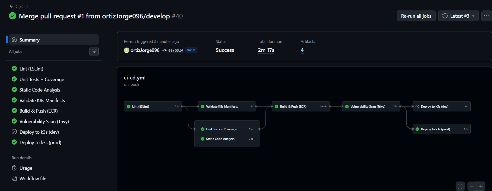

**Run #36 — `develop` → dev deploy (all jobs green):**

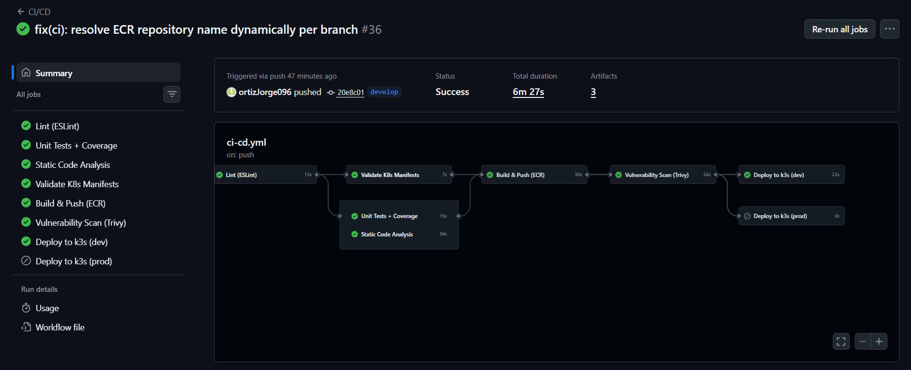

**Run #22 — `develop` (legacy single-deploy job):**

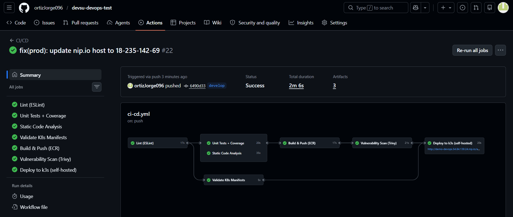

---

### 9.2 Public endpoints

| Environment | URL | Response |
|---|---|---|
| **Prod** | `https://demo-devops.18-235-142-69.nip.io/api/users` | `HTTP/2 200`, body `[]` |
| Dev | `http://demo-devops.54-84-139-24.nip.io/api/users` | `HTTP/1.1 200`, body `[]` |

**TLS on prod — real Let's Encrypt cert, end-to-end verified.**
`curl -v` shows the chain validates against the system trust store; no
`-k` / `--insecure` flag. Browsers show the green padlock with no
warnings.

```
* Connected to demo-devops.18-235-142-69.nip.io (18.235.142.69) port 443
* SSL connection using TLSv1.3 / TLS_AES_128_GCM_SHA256 / X25519 / RSASSA-PSS
* ALPN: server accepted h2
* Server certificate:
*  subject: CN=demo-devops.18-235-142-69.nip.io
*  start date: May 24 11:14:32 2026 GMT
*  expire date: Aug 22 11:14:31 2026 GMT
*  subjectAltName: host "demo-devops.18-235-142-69.nip.io" matched cert's "demo-devops.18-235-142-69.nip.io"
*  issuer: C=US; O=Let's Encrypt; CN=R13
*  SSL certificate verify ok.
< HTTP/2 200
< content-type: application/json; charset=utf-8
```

Issuer `Let's Encrypt R13` is one of LE's current intermediates.
cert-manager renews automatically ~30 days before expiry.

**`curl -v` — TLS handshake completo con Let's Encrypt R13:**

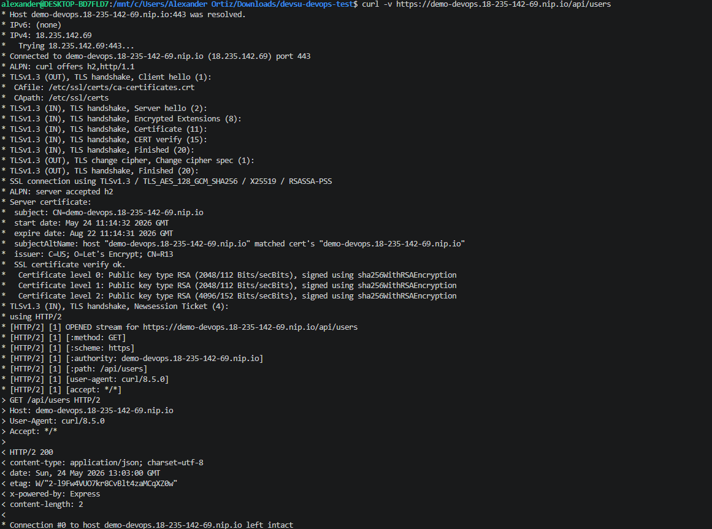

**Browser prod — HTTPS con candado verde (`18-235-142-69.nip.io`):**

![Browser mostrando endpoint prod HTTPS respondiendo []](docs/screenshots/16-browser-prod-https.png)

**Browser dev — HTTP (`54.84.139.24.nip.io`):**

![Browser mostrando endpoint dev HTTP respondiendo []](docs/screenshots/10-browser-dev-endpoint.png)

---

### 9.3 Kubernetes state — prod (`kubectl -n demo-devops get deploy,hpa,pdb,svc,ingress`)

```
NAME                         READY   UP-TO-DATE   AVAILABLE
deployment.apps/demo-devops  2/2     2            2

NAME                                       REFERENCE                TARGETS                        MINPODS   MAXPODS   REPLICAS
horizontalpodautoscaler.../demo-devops     Deployment/demo-devops   cpu: 2%/70%, memory: 38%/80%   2         3         2

NAME                                       MIN AVAILABLE   ALLOWED DISRUPTIONS
poddisruptionbudget.policy/demo-devops     1               1

NAME                  TYPE        CLUSTER-IP      PORT(S)
service/demo-devops   ClusterIP   10.43.101.192   80/TCP

NAME                                       CLASS     HOSTS                              ADDRESS      PORTS
ingress.networking.k8s.io/demo-devops      traefik   demo-devops.18-235-142-69.nip.io   10.0.0.108   80, 443
```

Mapping to the brief:

- **≥ 2 replicas** → `Deployment 2/2 ready`.
- **Horizontal scaling** → HPA `2..3` envelope reporting real CPU / memory metrics.
- **ConfigMap + Secret** → consumed via `envFrom` on the Deployment (`kubectl -n demo-devops get cm,secret` lists `demo-devops-config` and `demo-devops-secret`).
- **Ingress** → traefik, host on nip.io, ports 80 + 443.
- **PodDisruptionBudget** → `minAvailable: 1` keeps one pod serving during voluntary disruptions.
- **NetworkPolicy** → default-deny ingress, allowed from `ingress-nginx` / `kube-system` namespaces and same-namespace pods (`kubectl -n demo-devops get netpol`).

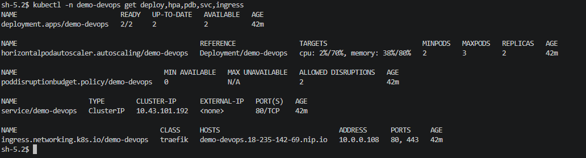

---

### 9.4 AWS infrastructure (account `864058201845`, region `us-east-1`)

| Resource | Identifier |
|---|---|
| EC2 — prod | `i-075e2dd6c282e0534` · `t3.medium` · AZ `us-east-1a` · 3/3 status checks · EIP `18.235.142.69` |
| EC2 — dev | `i-0b2dcd0c53d192543` · `t3.medium` · AZ `us-east-1a` · 3/3 status checks · EIP `54.84.139.24` |
| ASG — prod | `devsu-devops-test-prod-k3s` · desired = 1 · "At desired capacity" |
| ASG — dev | `devsu-devops-test-dev-k3s` · desired = 1 · "At desired capacity" |
| ECR — prod | `864058201845.dkr.ecr.us-east-1.amazonaws.com/devsu-devops-test-prod-nodejs` |
| ECR — dev | `864058201845.dkr.ecr.us-east-1.amazonaws.com/devsu-devops-test-dev-nodejs` |
| IAM OIDC provider | `arn:aws:iam::864058201845:oidc-provider/token.actions.githubusercontent.com` (single, shared between envs) |
| IAM role (CI, prod) | `arn:aws:iam::864058201845:role/devsu-devops-test-prod-gha-deploy` |
| IAM role (CI, dev) | `arn:aws:iam::864058201845:role/devsu-devops-test-dev-gha-deploy` |
| SNS topic | `arn:aws:sns:us-east-1:864058201845:devsu-devops-alarms` |
| SNS subscription | `email` → `jcaballeroo96@gmail.com` · **Confirmed** |

**EC2 instances — prod y dev corriendo (3/3 status checks):**

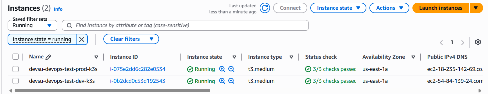

**Auto Scaling Groups — prod y dev:**

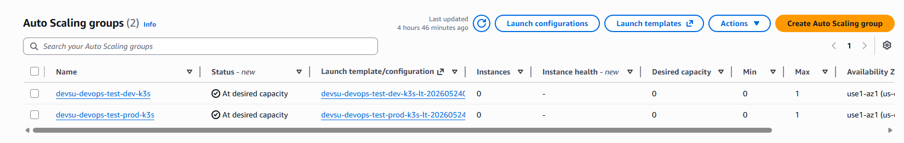

**ASG prod — capacity detail:**

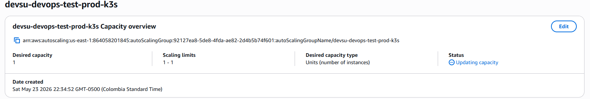

**Terraform outputs — identifiers completos:**

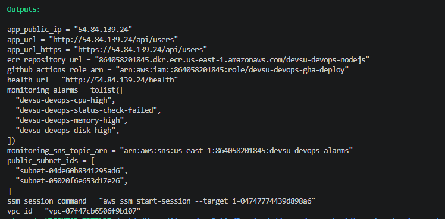

**AWS CLI — EC2 running, IAM OIDC provider, SNS subscription confirmed, CloudWatch alarms:**

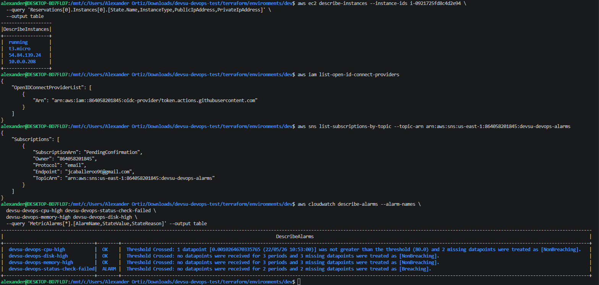

**SNS subscription — email confirmado:**

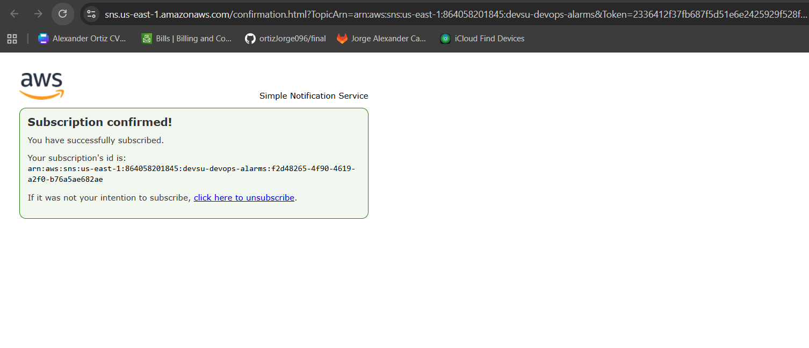

---

### 9.5 Observability (CloudWatch alarms)

`aws cloudwatch describe-alarms --alarm-names devsu-devops-{cpu-high,memory-high,disk-high,status-check-failed}`:

| Alarm | State | Notes |
|---|---|---|
| `devsu-devops-cpu-high` | `OK` | Last datapoint ~0.001% (threshold 80%) |
| `devsu-devops-memory-high` | `OK` | CW Agent custom metric `mem_used_percent` |
| `devsu-devops-disk-high` | `OK` | CW Agent custom metric `disk_used_percent` |
| `devsu-devops-status-check-failed` | Transitions during instance refresh / Spot reclaim | Mode-dependent — see ADR-009 for the ASG-based replacement behavior |

All four alarms publish to the SNS topic above; the confirmed email
subscription receives notifications.

> The CloudWatch alarms output is visible in the combined AWS CLI screenshot above (`06-aws-cli-infra-alarms.png`), which shows the full `describe-alarms` table with state values and threshold reasons.

**Alarma real recibida por email — `devsu-devops-status-check-failed` en acción:**

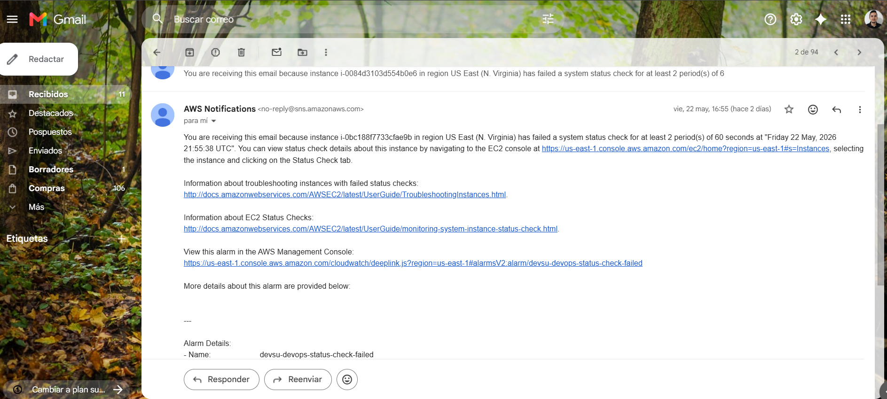

> La alarma `status-check-failed` transitó a `ALARM` el viernes 22 de mayo cuando la instancia
> Spot fue reemplazada por el ASG (comportamiento esperado — ver ADR-009). El email confirma
> que el pipeline completo de observabilidad funciona: CloudWatch → SNS topic → email entregado
> a `jcaballeroo96@gmail.com`.

---

### 9.6 GitHub repository configuration

- **Environments** — `production` (branch `main`) and `dev` (branch `develop`), each with its own `AWS_ROLE_ARN` environment secret pointing at the matching IAM role from §9.4.
- **Repository secrets / variables** — `APP_URL`, `AWS_ROLE_ARN` (fallback).
- **OIDC trust policy** — `sub` claim scoped to `repo:ortizJorge096/devsu-devops-test:environment:<production|dev>` (see `terraform/modules/github-oidc/main.tf`). No static AWS keys committed anywhere.

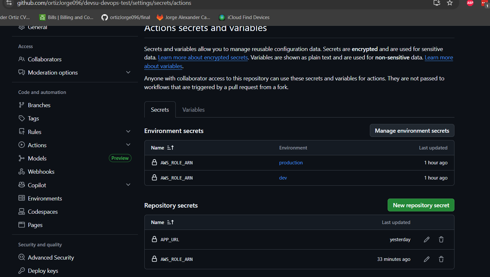

---

### 9.7 Local validation (for reviewers without AWS credentials)

- **Docker** — `docker build -t demo-devops-nodejs:dev ./app && docker run --rm -p 8000:8000 demo-devops-nodejs:dev`. `docker ps` reports `STATUS: Up X minutes (healthy)`. `curl -fsS http://localhost:8000/health` → `{"status":"ok","uptime":…,"timestamp":"…"}`.
- **minikube / docker-desktop** — `scripts/local-deploy.sh` applies the `local` overlay (2 replicas, HPA 2..6). `kubectl -n demo-devops get pods -w` shows both pods `Running`. `scripts/port-forward.sh` + `curl -X POST http://localhost:8080/api/users -d '{"dni":"k8s-001","name":"From K8s"}'` then `GET /api/users` returns the persisted record `[{"id":1,"name":"From K8s","dni":"k8s-001"}]`.

**Docker — container corriendo con healthcheck OK:**

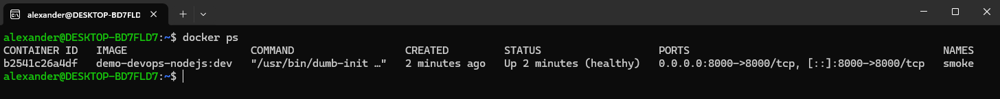

**Docker — health endpoint respondiendo:**

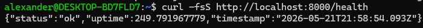

**Kubernetes local — pods running + port-forward + POST/GET users:**

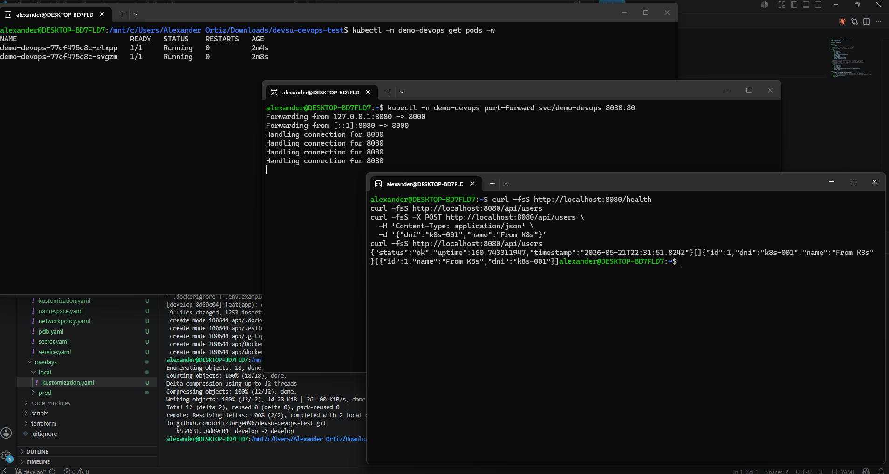

---

### 9.8 Where to look in the GitHub UI

- **Workflow runs** → Actions tab → `CI/CD` workflow.
- **Security findings (Trivy + njsscan SARIFs)** → Security tab → Code scanning.
- **Environments and secrets** → Settings → Secrets and variables → Actions.

---

## 10. Troubleshooting

| Symptom | Fix |
|---|---|
| `ImagePullBackOff` on k3s | `/etc/rancher/k3s/registries.yaml` is missing or stale. `sudo /usr/local/sbin/refresh-ecr-token.sh` re-mints the auth block and HUPs k3s. Also check `journalctl -u refresh-ecr-token.timer`. |
| Pod CrashLoopBackOff with sqlite errors | The `data/` emptyDir didn't mount as writable — check `securityContext.fsGroup` and `readOnlyRootFilesystem: true` + writable volume. |
| `terraform init` complains about lock | You're on Terraform < 1.10; upgrade or remove `use_lockfile = true` from `backend.tf` (and add DynamoDB). |
| EC2 has no kubectl access | Open a shell via the Terraform output `ssm_session_command`, then `sudo cat /etc/rancher/k3s/k3s.yaml`. To use it from your laptop, rewrite `server: https://<EIP>:6443`. |
| Healthcheck fails inside Docker | The image uses `wget`; if you replace the base image, install `wget` or switch to `curl --fail`. |
| `Deploy` job fails: "no runner matching labels [self-hosted, k3s-deploy]" | The EC2 finished `user-data` but didn't register. Check `journalctl -u actions.runner.*` on the box. Most common cause: `github_token` was missing or expired at `terraform apply` time. |
| Spot reclamation message in AWS console | The ASG launches a replacement automatically (~30-90 s after the rebalance recommendation). Check `aws autoscaling describe-scaling-activities --auto-scaling-group-name $(terraform output -raw asg_name)` for status, or watch the AWS console. The persistent EIP is re-attached by user-data within the first minute of boot, so the `nip.io` URL stays valid. (ADR-009) |
| `Deploy` job hangs "Waiting for a runner to pick up this job" right after a reclaim | The previous runner is offline and the replacement is still booting (~5-7 min). The new instance auto-deletes the offline runner before registering itself. Just wait — or re-run the failed job. |
| Pure Spot capacity gone across all pools | Edit the env tfvars: set `on_demand_percentage_above_base_capacity = 100` and `terraform apply`. The ASG will launch on-demand from the same Launch Template. Revert when Spot recovers. |
| Out-of-memory on dev pod | t3.micro is tight with 2 replicas + the runner. Either turn off `cloudwatch_agent_config` or move to `t3.small` (see ADR-006 migration path). |
| TLS handshake fails on prod (`SSL_ERROR_NO_CYPHER_OVERLAP` / NET::ERR_CERT_AUTHORITY_INVALID) | cert-manager hasn't issued the cert yet. `kubectl -n demo-devops describe certificate demo-devops-tls` shows the status. Most common: the ACME HTTP-01 challenge failed because the nip.io FQDN doesn't resolve back to this EIP (check `dig demo-devops.<eip>.nip.io`). Until issuance succeeds, traefik serves its self-signed default — same UX as dev. |
| Let's Encrypt rate-limit error in cert-manager logs | nip.io shares one eTLD+1 across all users. Switch the Ingress annotation to `letsencrypt-staging` (already provisioned) and re-test; switch back after 7 days. ADR-008 §"Migration paths" covers this. |

---

## 11. License

MIT — see `LICENSE`.
